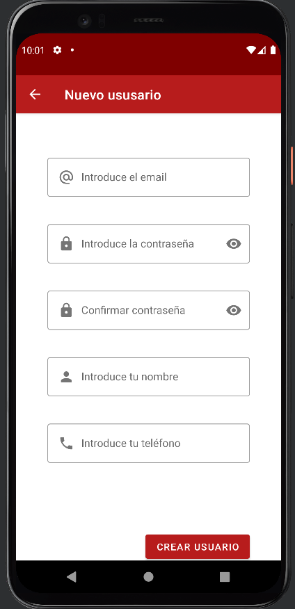
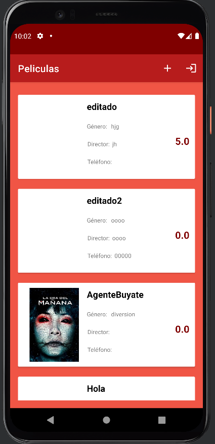
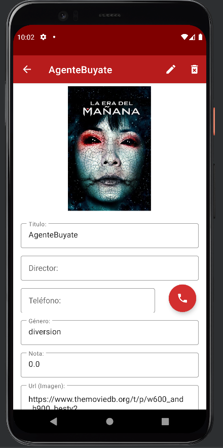

## App gestión de películas (API)

**Pantallas app:**

1. Registro
2. Login
3. Lista películas
4. Detalles películas

**Pantalla inicio de sesión:**

**Pantalla de registro:**

**Pantalla de listado de películas:**

**Pantalla detalles película:**

# Funcionamiento básico de la app:

1. La app comprueba si el token guardado en el SharedPreference está caducado o no.

2. Si el token está caducado va a la pantalla de inicio de sesión y crea uno nuevo, en el caso contrario va directamente al listado de películas.

3. Si no tienes un usuario con el que iniciar sesión vas a la pantalla de registro y creas un nuevo usuario.
 
4. En la pantalla de listado de películas podemos crear una nueva película o acceder a los detalles de las existentes.

5. En la pantalla de detalles podemos borrar o editar una película.

6. Todas estas operaciones se realizan desde una api externa.
