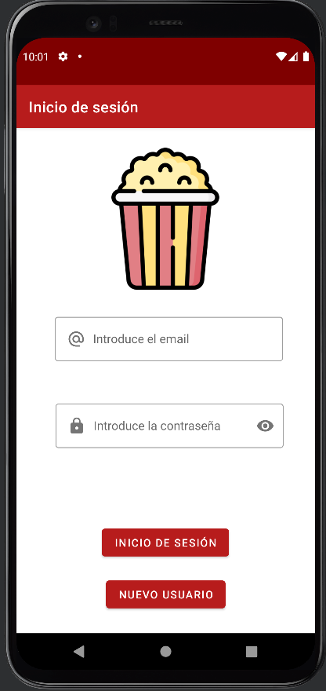

## App gestión de películas (API)

**Pantallas app:**

1. Registro
2. Inicio sesión
3. Lista películas
4. Detalles películas

**Pantalla inicio de sesión:**

**Pantalla de registro:**

**Pantalla de listado de películas:**

**Pantalla detalles película:**

# Funcionamiento básico de la app:

La app comprueba si el token guardado en el SharedPreference está caducado o no, si el token está caducado va a la pantalla de inicio de sesión y crea uno nuevo, en el caso contrario va directamente al listado de películas. Si no tienes un usuario con el que iniciar sesión vas a la pantalla de registro y creas un nuevo usuario.

En la pantalla de listado de películas podemos crear una nueva película o acceder a los detalles de las existentes al etrar en la pantalla de detalles podemos borrar o editarla, todas estas operaciones se realizan desde una api externa.
